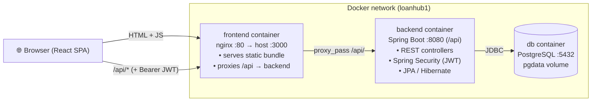
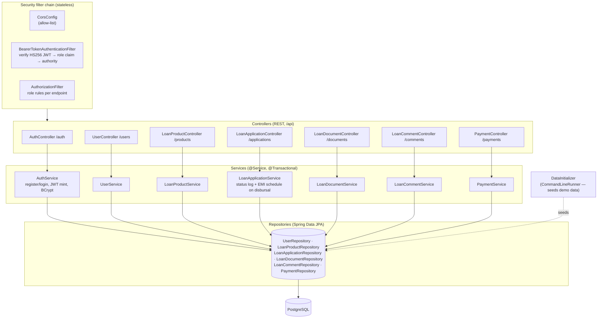
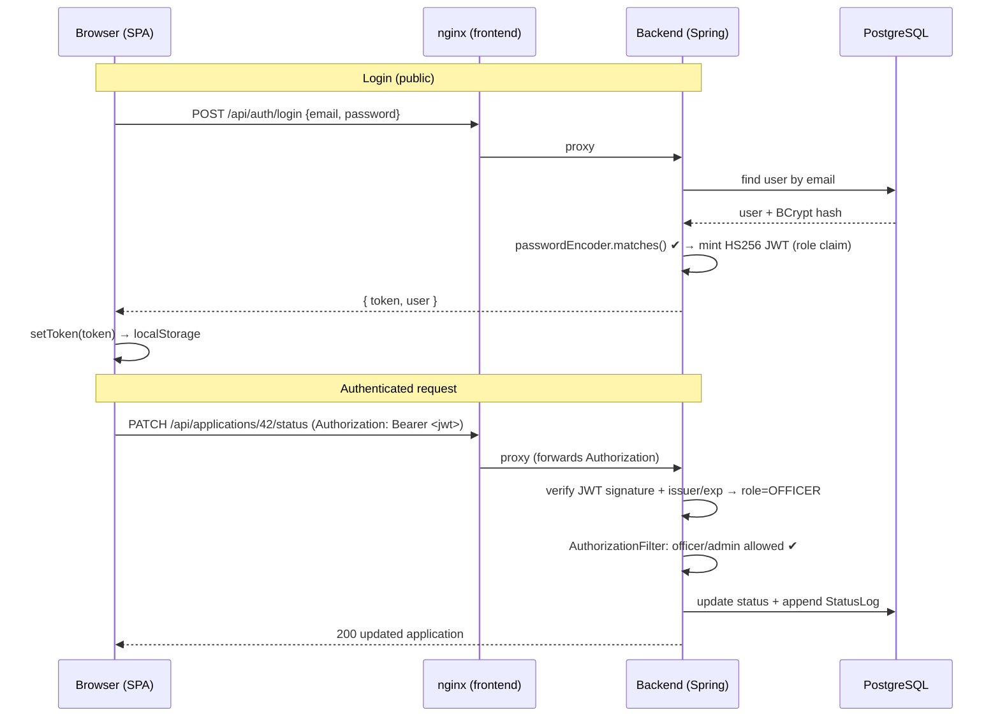
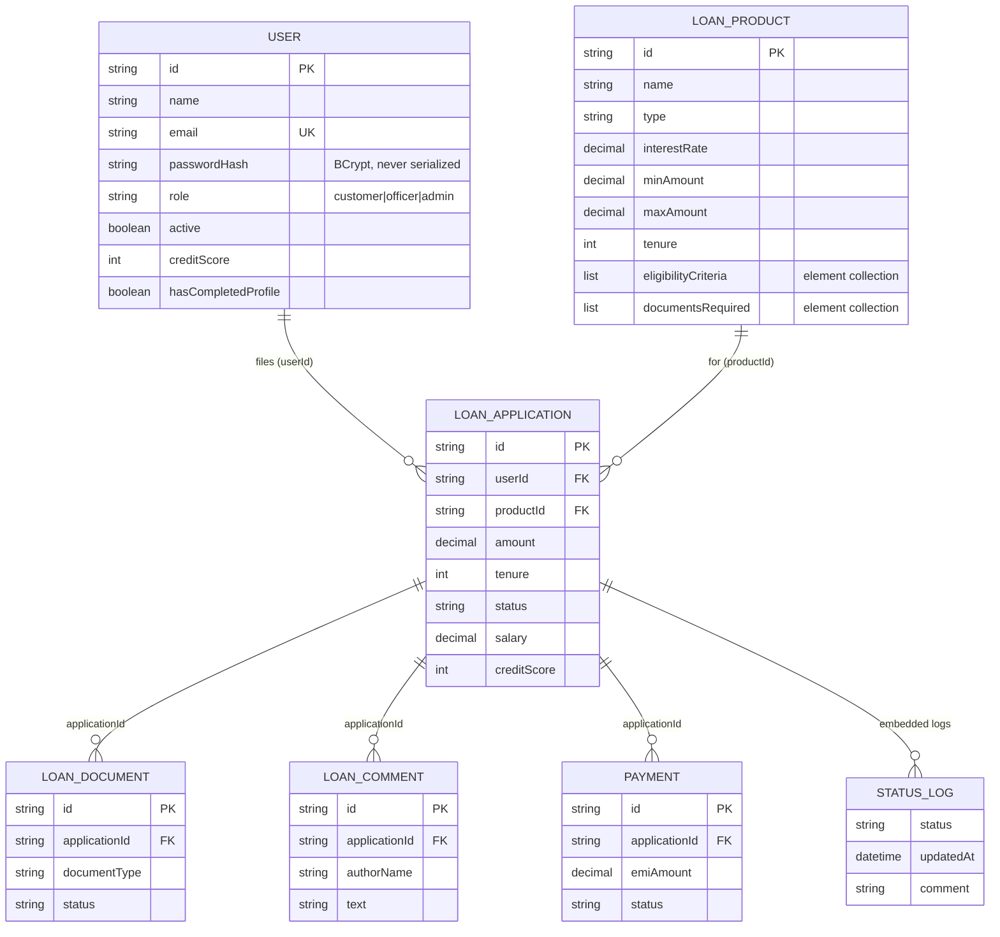
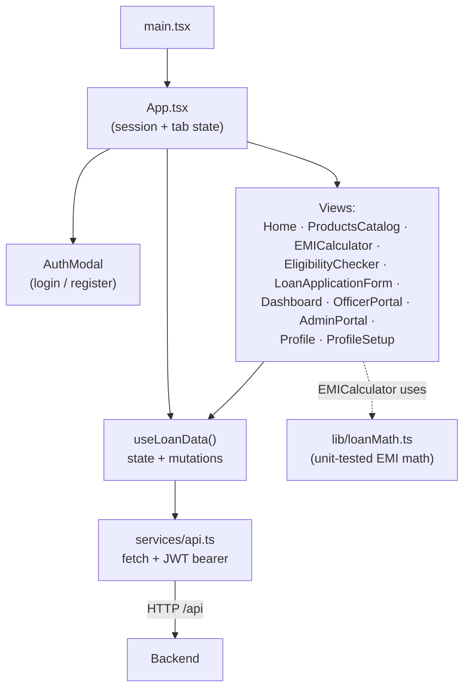

# LoanHub — Digital Banking Loan Portal

Production deployment: **AWS EKS** (ap-south-1) · GitOps via **ArgoCD** · CI via **GitHub Actions** · Infra as Code via **Terraform**.

Three independently-deployable tiers:

- **Frontend** — React 19 + TypeScript + Vite, served by nginx-unprivileged in production.
- **Backend** — Java 21 + Spring Boot 3.2 REST API, secured with Spring Security (HS256 JWT).
- **Database** — PostgreSQL 16 on AWS RDS.

> **Step-by-step reproduction guide (including all errors + fixes):** see [GUIDE.md](GUIDE.md)

Authentication is **self-contained** (no third-party identity provider): users register and
log in with email + password (stored as BCrypt hashes in PostgreSQL), and the backend issues
a signed **JWT** on success. Spring Security verifies that token on every protected request.
The caller's **role** (customer / officer / admin) lives in the server-signed token, so
privileged actions are enforced server-side and cannot be forged by the client.

## Layout

The two application tiers live in separate, self-contained directories (each its own Docker
build context):

```
.
├── frontend/   # React + Vite app, nginx Dockerfile  (own package.json, src/, .env)
├── backend/    # Spring Boot API, JRE Dockerfile      (own pom.xml, src/main, src/test)
└── docker-compose.yml
```

## Architecture

### 1. System / deployment view

Three containers on a private Docker network. The browser only ever talks to the frontend
origin; nginx serves the static SPA and reverse-proxies `/api` to the backend, so API calls
are same-origin (no CORS in the Docker setup). Only the backend talks to PostgreSQL.

```
                          ┌─────────────────────────── Docker host ───────────────────────────┐
                          │                                                                    │
   ┌──────────┐  :3000    │  ┌─────────────────────┐      :8080     ┌──────────────────────┐   │
   │ Browser  │ ────────▶ │  │ frontend (nginx)    │ ─────────────▶ │ backend (Spring Boot)│   │
   │  (SPA)   │ ◀──────── │  │  • static React JS  │   /api proxy   │  • REST + Security   │   │
   └──────────┘   HTML/   │  │  • proxy /api/ ───▶ │ ◀───────────── │  • JWT verify        │   │
        ▲          JSON   │  └─────────────────────┘     JSON       └───────────┬──────────┘   │
        │                 │         loanhub1-frontend                            │ JDBC :5432  │
        │  JWT in          │                                          ┌──────────▼──────────┐   │
        │  Authorization   │                                          │ db (postgres:16)    │   │
        │  header          │                                          │  • loanhub schema   │   │
        │                 │                                          │  • pgdata volume    │   │
        └─────────────────┼──────────────────────────────────────── └─────────────────────┘   │
                          └────────────────────────────────────────────────────────────────────┘
```



### 2. Backend layered architecture

Classic Controller → Service → Repository layering. A stateless Spring Security filter chain
sits in front of the controllers and authenticates every request from the `Bearer` JWT.



### 3. Authentication & request flow

Tokens are minted by the backend (HS256, signed with `JWT_SECRET`) and carry the user's
`role` claim. The frontend stores the JWT in `localStorage` and attaches it to every call;
the role inside the signed token drives authorization, so it can't be forged client-side.



### 4. Domain / data model

Entities are persisted via JPA. `StatusLog` is an `@Embeddable` element-collection on the
application (its audit trail); product eligibility/document lists are element-collections too.
Cross-entity links are by string id (no hard FK constraints), shown here logically.



### 5. Frontend structure

A single `App` owns view/session state; the `useLoanData` hook is the data layer (loads
public products on mount, and the user's protected collections after login) and `services/api.ts`
is the only place that talks HTTP (token attach + error handling). Components are presentational.



### 6. REST API surface

| Method & path (under `/api`)       | Purpose                          | Access            |
|------------------------------------|----------------------------------|-------------------|
| `POST /auth/register`              | Create customer + issue JWT      | public            |
| `POST /auth/login`                 | Authenticate + issue JWT         | public            |
| `GET  /auth/me`                    | Current user from token          | authenticated     |
| `GET  /products`, `/products/**`   | Browse catalog                   | public            |
| `POST /products`                   | Add product                      | admin             |
| `PATCH /products/{id}/rate`        | Change interest rate             | admin             |
| `GET  /users`                      | List users                       | admin             |
| `PUT  /users/{id}`                 | Update own profile               | authenticated     |
| `PATCH /users/{id}/toggle-active`  | Block / unblock account          | admin             |
| `GET/POST /applications`           | List / file applications         | authenticated     |
| `PATCH /applications/{id}/status`  | Advance workflow (+ EMI on disbursal) | officer / admin |
| `GET/POST /documents`              | List / upload documents          | authenticated     |
| `PATCH /documents/{id}/status`     | Verify / reject document         | officer / admin   |
| `GET/POST /comments`               | List / add review comments       | authenticated     |
| `GET /payments`, `PATCH /payments/{id}/pay` | List / pay EMIs         | authenticated     |

## Quick start with Docker (all three containers)

```bash
cp .env.example .env       # set a DB password + a JWT secret (>= 32 chars)
docker compose up --build
```

- App: <http://localhost:3000> (the SPA calls `/api`, proxied to the backend by nginx)
- API (direct): <http://localhost:8080/api>
- PostgreSQL: localhost:5432 (inside the compose network it's `db:5432`)

If port 3000 is already taken (`Bind for 0.0.0.0:3000 failed: port is already allocated`),
either stop the other service or set a different host port: `FRONTEND_PORT=3001 docker compose up`
(or put `FRONTEND_PORT=3001` in `.env`), then open <http://localhost:3001>.

Containers:

| Service    | Image / build           | Port           |
|------------|-------------------------|----------------|
| `db`       | `postgres:16-alpine`    | 5432           |
| `backend`  | `./backend/Dockerfile`  | 8080           |
| `frontend` | `./frontend/Dockerfile` | 3000 → nginx80 |

## Running tiers individually (without Docker)

**Prerequisites:** Node.js 18+, JDK 21 + Maven, a local PostgreSQL.

1. **Database** — create a `loanhub` database/user (or run just the DB container:
   `docker compose up db`).
2. **Backend** (port 8080), from `backend/`:
   ```bash
   cd backend
   export JWT_SECRET=change-me-to-a-long-random-secret-at-least-32-chars
   export SPRING_DATASOURCE_URL=jdbc:postgresql://localhost:5432/loanhub
   export SPRING_DATASOURCE_USERNAME=loanhub SPRING_DATASOURCE_PASSWORD=loanhub
   mvn spring-boot:run
   ```
   Demo data (users, products, applications, …) is seeded automatically on first start.
   Run the test suite (uses in-memory H2, no DB needed): `mvn test`.
3. **Frontend** (port 3000), from `frontend/`:
   ```bash
   cd frontend
   npm install
   cp .env.example .env     # set VITE_* values
   npm run dev
   ```
   Frontend checks: `npm run lint` (tsc) and `npm test` (vitest).

## Configuration

All config comes from environment variables — see [.env.example](.env.example). Nothing
secret is committed to the repo.

- `JWT_SECRET` — HS256 signing secret for auth tokens (≥ 32 chars; required in production).
- `SPRING_DATASOURCE_*`, `POSTGRES_PASSWORD` — database connection.
- `APP_CORS_ALLOWED_ORIGINS` — backend CORS allow-list (no wildcard).
- `VITE_API_BASE_URL` — frontend's API base URL (`/api` behind nginx; full URL for `npm run dev`).

## Roles & authorization

Self-registration always creates a **customer** — enforced in the backend
(`AuthService.register`), so a client cannot grant itself officer/admin. The security filter
chain restricts privileged endpoints:

| Operation                                   | Required role     |
|---------------------------------------------|-------------------|
| Register / log in (`/auth/**`)              | public            |
| Browse products (`GET /products`)           | public            |
| Approve / advance applications, verify docs | officer or admin  |
| Manage products & rates, block users        | admin             |
| Everything else                             | any authenticated |

Demo logins (password `password123`, seeded into the database on first start):

| Role     | Email                  |
|----------|------------------------|
| Customer | raj.nayan@scaler.com   |
| Officer  | officer@hdfcland.com   |
| Admin    | admin@hdfcland.com     |

> Note: read endpoints (listing applications/documents) currently require only
> authentication, not per-record ownership. Privileged *mutations* are role-gated. Adding
> owner-level read scoping is a sensible next step.
